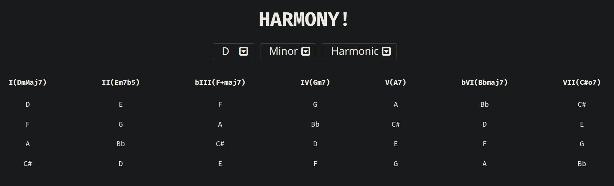

# Harmony Sequence!

Just a small project in React and Vite using the [tonal](https://github.com/tonaljs/tonal) lib and [zustand](https://docs.pmnd.rs/zustand/getting-started/introduction).
This is supposed to be a fun project for musicians and music lovers, like I am.

I don't have much plans to improve this, but maybe use some of other functionalities tonal has to offer. Feel free to contribute!!
